# Modelo de Dados (Database Schema Specification)
## Katrix Estoque · Sistema de Gestão de Ativos de TI

> **Versão:** 2.0.0  
> **Data:** 2026-08-26  
> **Status:** Modelo Atualizado e Validado (Arquitetura TPT + RBAC Híbrido Completo)  
> **Autores:** Product Owner Sênior & Arquiteto de Software  
> **ORM / Engine:** Prisma ORM v7.8.0 / PostgreSQL 15 (Docker)  
> **Documentos de Referência:** [PRD](PRD.md) | [SRS](SRS.md) | [Use Cases](Use_Cases.md)

---

## Sumário

1. [Visão Geral da Arquitetura de Dados](#1-visão-geral-da-arquitetura-de-dados)
2. [Diagrama Entidade-Relacionamento (ERD Visual)](#2-diagrama-entidade-relacionamento-erd-visual)
3. [Dicionário de Dados Completo](#3-dicionário-de-dados-completo)
   - 3.1 [Entidade Usuario](#31-entidade-usuario)
   - 3.2 [Entidade Role](#32-entidade-role)
   - 3.3 [Entidade Permissao](#33-entidade-permissao)
   - 3.4 [Entidade PermissaoRole](#34-entidade-permissaorole)
   - 3.5 [Entidade PermissaoUser](#35-entidade-permissaouser)
   - 3.6 [Entidade Responsavel](#36-entidade-responsavel)
   - 3.7 [Entidade Utensilio (Entidade Base TPT)](#37-entidade-utensilio-entidade-base-tpt)
   - 3.8 [Entidade Eletronico (Especialização)](#38-entidade-eletronico-especialização)
   - 3.9 [Entidade Chip (Especialização)](#39-entidade-chip-especialização)
   - 3.10 [Entidade Periferico (Especialização)](#310-entidade-periferico-especialização)
   - 3.11 [Entidade Vinculo](#311-entidade-vinculo)
   - 3.12 [Entidade HistoricoObjeto](#312-entidade-historicoobjeto)
4. [Dicionário de Tipos Enumerados (Enums)](#4-dicionário-de-tipos-enumerados-enums)
5. [Justificativas do Design Atual](#5-justificativas-do-design-atual)
   - 5.1 [Herança Table-per-Type (TPT) com a Entidade Base Utensilio](#51-herança-table-per-type-tpt-com-a-entidade-base-utensilio)
   - 5.2 [Unificação do Relacionamento de Vínculo (Vinculo -> Utensilio)](#52-unificação-do-relacionamento-de-vínculo-vinculo---utensilio)
   - 5.3 [Implementação Estrutural do RBAC Híbrido (PermissaoRole + PermissaoUser)](#53-implementação-estrutural-do-rbac-híbrido-permissaorole--permissaouser)
   - 5.4 [Segurança Relacional com Políticas onDelete: Restrict](#54-segurança-relacional-com-políticas-ondelete-restrict)
   - 5.5 [Auditoria e Imutabilidade Estrita (HistoricoObjeto)](#55-auditoria-e-imutabilidade-estrita-historicoobjeto)
6. [Oportunidades de Evolução e Refatoração Contínua](#6-oportunidades-de-evolução-e-refatoração-contínua)
   - 6.1 [Novos Índices Compostos para Consultas Multicritério](#61-novos-índices-compostos-para-consultas-multicritério)
   - 6.2 [Criptografia em Repouso para Atributos Sensíveis](#62-criptografia-em-repouso-para-atributos-sensíveis)
   - 6.3 [Padronização Semântica de Nomenclatura (@map)](#63-padronização-semântica-de-nomenclatura-map)

---

## 1. Visão Geral da Arquitetura de Dados

O modelo de dados do **Katrix Estoque** evoluiu para uma arquitetura relacional altamente desacoplada, extensível e segura.

### Destaques da Nova Estruturação:
- **Herança Table-per-Type (TPT) com `Utensilio`:** Centraliza atributos operacionais comuns (`categoria`, `cidade`, `situacao`, `condicao`) na entidade base `Utensilio`, enquanto as tabelas `Eletronico`, `Chip` e `Periferico` atuam como extensões especializadas 1:1 compartilhando a mesma chave primária (`utensilioId`).
- **Desacoplamento de `Vinculo`:** A entidade `Vinculo` agora referencia diretamente `Utensilio`, eliminando três relações opcionais e múltiplos switches condicionais no backend.
- **RBAC Híbrido Integral no Banco:** Presença nativa das entidades `PermissaoRole` (permissões do cargo) e `PermissaoUser` (exceções granulares atribuídas diretamente ao usuário), permitindo ao `PermissionGuard` resolver autorizações com precedência determinística.
- **Proteção contra Deleção em Cascata (`onDelete: Restrict`):** Garantia de que cargos, permissões e usuários em uso não possam ser deletados acidentalmente.

---

## 2. Diagrama Entidade-Relacionamento (ERD Visual)

O diagrama a seguir reflete a topologia relacional do schema Prisma atualizado:

```mermaid
erDiagram
    Role ||--o{ PermissaoRole : "possui (1:N)"
    Permissao ||--o{ PermissaoRole : "atribuida_em (1:N)"
    Role ||--o{ Usuario : "define_cargo (1:N)"

    Usuario ||--o{ PermissaoUser : "recebe_excecao (1:N)"
    Permissao ||--o{ PermissaoUser : "concedida_diretamente (1:N)"

    Responsavel ||--o{ Vinculo : "custodia (1:N)"
    Responsavel ||--o{ HistoricoObjeto : "participa (1:N)"
    Vinculo ||--o{ HistoricoObjeto : "registra_eventos (1:N)"

    Utensilio ||--o{ Vinculo : "historico_vinculos (1:N)"
    Utensilio ||--o| Eletronico : "especializa_1to1 (1:1)"
    Utensilio ||--o| Chip : "especializa_1to1 (1:1)"
    Utensilio ||--o| Periferico : "especializa_1to1 (1:1)"

    Usuario {
        String id PK "UUIDv4"
        String nome "Nome do operador"
        String email UK "E-mail único de login"
        String senha "Hash bcrypt da credencial"
        String roleId FK "Cargo base do usuário (Restrict)"
        String responsavelId "Vínculo opcional com colaborador"
        Boolean ativo "Status da conta (default true)"
        String avatarUrl "URL da imagem de perfil"
        DateTime createAt "Data de cadastro"
        DateTime updateAt "Última atualização"
    }

    Role {
        String id PK "UUIDv4"
        String nome UK "Nome único do cargo"
        String descricao "Descrição das atribuições"
        DateTime createAt "Data de criação"
        DateTime updateAt "Última atualização"
    }

    Permissao {
        String id PK "UUIDv4"
        String key UK "Chave única da ação (ex: vinculo:create)"
        String descricao "Finalidade da permissão"
        DateTime createAt "Data de criação"
        DateTime updateAt "Última atualização"
    }

    PermissaoRole {
        String roleId PK,FK "Referência ao Role (Restrict)"
        String permissaoId PK,FK "Referência à Permissão (Restrict)"
    }

    PermissaoUser {
        String userId PK,FK "Referência ao Usuário (Restrict)"
        String permissaoId PK,FK "Referência à Permissão (Restrict)"
    }

    Responsavel {
        String id PK "UUIDv4"
        String nome "Nome completo do colaborador"
        String email UK "E-mail corporativo único"
        Setores setor "Setor de atuação"
        Cidades cidade "Polo operacional"
        Boolean status "Flag de atividade (Soft delete)"
        String assinatura "Assinatura ou termo digital"
    }

    Utensilio {
        String id PK "UUIDv4"
        CategoriaDispositivo categoria "ELETRONICO | CHIP | PERIFERICO"
        Cidades cidade "Polo geográfico onde o item se encontra"
        Status situacao "LIVRE | OCUPADO (default LIVRE)"
        Condicao condicao "NOVO | SEMI_NOVO | USADO"
    }

    Eletronico {
        String utensilioId PK,FK "Chave 1:1 apontando para Utensilio.id"
        Aparelhos tipo "NOTEBOOK | CELULAR | TABLET"
        String numeroSerie UK "Serial number físico único"
        Marcas marca "Fabricante do dispositivo"
        String modelo "Modelo comercial"
        String senha "Senha opcional de desbloqueio"
        Boolean seguro "Possui apólice de seguro"
    }

    Chip {
        String utensilioId PK,FK "Chave 1:1 apontando para Utensilio.id"
        Operadoras operadora "CLARO | TIM | VIVO"
        String ddd "Código de área (2 dígitos)"
        String numero UK "Número da linha telefônica"
    }

    Periferico {
        String utensilioId PK,FK "Chave 1:1 apontando para Utensilio.id"
        Perifericos tipo "MOUSE | TECLADO | MOUSE_PAD | CARREGADOR | SUPORTE"
        Marcas marca "Fabricante do acessório"
    }

    Vinculo {
        String id PK "UUIDv4"
        Boolean status "Status do vínculo (true=ativo, false=encerrado)"
        String responsavelId FK "Colaborador custodiante"
        String utensilioId FK "Item físico custodiado"
        String detalhes "Observações da entrega"
        DateTime createAt "Data/hora da vinculação"
        DateTime updateAt "Data/hora do encerramento/modificação"
    }

    HistoricoObjeto {
        String id PK "UUIDv4"
        String vinculoId FK "Vínculo gerador do evento"
        String responsavelId FK "Colaborador envolvido na ação"
        Condicao condicao "Condição física no momento da ação"
        Acao acao "ENTREGUE | DEVOLVIDO"
        String detalhes "Observações registradas na ação"
        DateTime createAt "Timestamp imutável do evento"
    }
```


---

## 3. Dicionário de Dados Completo

### 3.1 Entidade `Usuario`

Armazena as contas de acesso dos operadores e administradores do sistema com suporte a controle de atividade e auditoria temporal.

| Nome do Campo | Tipo de Dado | Restrições / Chaves | Obrigatório? | Descrição de Negócio |
|---|---|---|---|---|
| `id` | `String` (UUID) | `@id`, `@default(uuid())` | **Sim** | Identificador único universal do usuário operador. |
| `nome` | `String` | — | **Sim** | Nome completo do operador para identificação na interface e logs de auditoria. |
| `email` | `String` | `@unique` | **Sim** | E-mail corporativo exclusivo utilizado para autenticação no sistema. |
| `senha` | `String` | — | **Sim** | Hash criptográfico unidirecional seguro (Bcrypt salt >= 10) da senha de acesso. |
| `roleId` | `String` (UUID) | `@relation(fields: [roleId], references: [id], onDelete: Restrict)` | **Sim** | Chave estrangeira que define o cargo base e permissões padrão do operador. Protegido contra deleção do cargo (`Restrict`). |
| `responsavelId` | `String?` (UUID) | Opcional | Não | Identificador opcional associando a conta do operador ao registro de colaborador em `Responsavel`. |
| `ativo` | `Boolean` | `@default(true)` | **Sim** | Flag de ativação da conta: `true` (acesso liberado) ou `false` (acesso suspenso imediatamente). |
| `avatarUrl` | `String?` | Opcional | Não | Link ou caminho da imagem de perfil do usuário. |
| `createAt` | `DateTime` | `@default(now())` | **Sim** | Data e hora exatas de cadastro da conta no sistema. |
| `updateAt` | `DateTime` | `@updatedAt` | **Sim** | Data e hora da última modificação dos dados do usuário. |

- **Índices Secundários:** `@@index([roleId])` (acelera queries de usuários por cargo).
- **Relacionamentos:**
  - `role` (`Role`): Cargo associado.
  - `permissaoUser` (`PermissaoUser[]`): Relação 1:N com as exceções de permissão concedidas diretamente ao operador.

---

### 3.2 Entidade `Role`

Representa os papéis corporativos atribuíveis aos operadores (ex: `ADMIN`, `GESTOR`, `ANALISTA`, `VIEWER`).

| Nome do Campo | Tipo de Dado | Restrições / Chaves | Obrigatório? | Descrição de Negócio |
|---|---|---|---|---|
| `id` | `String` (UUID) | `@id`, `@default(uuid())` | **Sim** | Identificador único universal do cargo. |
| `nome` | `String` | `@unique` | **Sim** | Nome único identificador do papel funcional no sistema. |
| `descricao` | `String?` | Opcional | Não | Descrição detalhada do escopo e responsabilidades do cargo. |
| `createAt` | `DateTime` | `@default(now())` | **Sim** | Data e hora de criação do cargo. |
| `updateAt` | `DateTime` | `@updatedAt` | **Sim** | Data e hora da última alteração do cargo. |

- **Relacionamentos:**
  - `permissoes` (`PermissaoRole[]`): Relação 1:N com as permissões atribuídas a este papel.
  - `usuarios` (`Usuario[]`): Relação 1:N com os operadores que possuem este cargo.

---

### 3.3 Entidade `Permissao`

Define as chaves canônicas de autorização para proteção de endpoints da API (ex: `vinculo:create`, `responsavel:delete`).

| Nome do Campo | Tipo de Dado | Restrições / Chaves | Obrigatório? | Descrição de Negócio |
|---|---|---|---|---|
| `id` | `String` (UUID) | `@id`, `@default(uuid())` | **Sim** | Identificador único universal da permissão. |
| `key` | `String` | `@unique` | **Sim** | Chave canônica de autorização no formato `modulo:acao`. |
| `descricao` | `String?` | Opcional | Não | Explicação da finalidade e impacto da permissão. |
| `createAt` | `DateTime` | `@default(now())` | **Sim** | Data e hora de cadastro da permissão. |
| `updateAt` | `DateTime` | `@updatedAt` | **Sim** | Data e hora da última atualização da permissão. |

- **Índices Secundários:** `@@index([key])` (acelera a busca por chave canônica durante a execução dos Guards).
- **Relacionamentos:**
  - `permissao` (`PermissaoRole[]`): Cargos que possuem esta permissão por padrão.
  - `permissaoUser` (`PermissaoUser[]`): Usuários que possuem esta permissão por exceção direta.

---

### 3.4 Entidade `PermissaoRole`

Tabela associativa que materializa o relacionamento N:M entre `Role` e `Permissao`.

| Nome do Campo | Tipo de Dado | Restrições / Chaves | Obrigatório? | Descrição de Negócio |
|---|---|---|---|---|
| `roleId` | `String` (UUID) | `@relation(fields: [roleId], references: [id], onDelete: Restrict)` | **Sim** | Chave estrangeira que referencia `Role.id`. Protegido contra deleção do cargo. |
| `permissaoId` | `String` (UUID) | `@relation(fields: [permissaoId], references: [id], onDelete: Restrict)` | **Sim** | Chave estrangeira que referencia `Permissao.id`. Protegido contra deleção da permissão. |

- **Chaves Compostas e Índices:**
  - `@@id([permissaoId, roleId])`: Chave primária composta impedindo permissões duplicadas no mesmo cargo.
  - `@@index([permissaoId])`: Índice secundário para junções reversas.

---

### 3.5 Entidade `PermissaoUser`

Tabela associativa que materializa a concessão de **exceções granulares diretas a usuários** (núcleo do modelo RBAC Híbrido).

| Nome do Campo | Tipo de Dado | Restrições / Chaves | Obrigatório? | Descrição de Negócio |
|---|---|---|---|---|
| `userId` | `String` (UUID) | `@relation(fields: [userId], references: [id], onDelete: Restrict)` | **Sim** | Chave estrangeira que referencia `Usuario.id`. |
| `permissaoId` | `String` (UUID) | `@relation(fields: [permissaoId], references: [id], onDelete: Restrict)` | **Sim** | Chave estrangeira que referencia `Permissao.id`. |

- **Chaves Compostas e Índices:**
  - `@@id([permissaoId, userId])`: Chave primária composta impedindo duplicidade de concessão direta ao mesmo usuário.
  - `@@index([permissaoId])`: Índice secundário para buscas e auditoria de usuários com acesso especial.

---

### 3.6 Entidade `Responsavel`

Cadastro autoritativo dos colaboradores corporativos autorizados a receber a custódia de itens de TI.

| Nome do Campo | Tipo de Dado | Restrições / Chaves | Obrigatório? | Descrição de Negócio |
|---|---|---|---|---|
| `id` | `String` (UUID) | `@id`, `@default(uuid())` | **Sim** | Identificador único universal do colaborador. |
| `nome` | `String` | — | **Sim** | Nome completo do colaborador custodiante. |
| `email` | `String` | `@unique` | **Sim** | E-mail corporativo institucional exclusivo do colaborador. |
| `setor` | `Setores` (Enum) | — | **Sim** | Área/departamento organizacional de alocação do colaborador. |
| `cidade` | `Cidades` (Enum) | — | **Sim** | Filial ou polo operacional de atuação do colaborador. |
| `status` | `Boolean` | — | **Sim** | Flag de atividade: `true` (ativo) ou `false` (inativo, bloqueado para novos vínculos). |
| `assinatura` | `String?` | Opcional | Não | Link ou vetor digital do termo de responsabilidade assinado. |

- **Relacionamentos:**
  - `vinculos` (`Vinculo[]`): Histórico de todos os vínculos de custódia do colaborador.
  - `historico` (`HistoricoObjeto[]`): Histórico de todas as movimentações nas quais o colaborador participou.

---

### 3.7 Entidade `Utensilio` (Entidade Base TPT)

Entidade genérica central que materializa o padrão Table-per-Type, concentrando atributos operacionais de ciclo de vida comuns a todos os ativos físicos.

| Nome do Campo | Tipo de Dado | Restrições / Chaves | Obrigatório? | Descrição de Negócio |
|---|---|---|---|---|
| `id` | `String` (UUID) | `@id`, `@default(uuid())` | **Sim** | Identificador único universal do item patrimonial. |
| `categoria` | `CategoriaDispositivo` (Enum) | — | **Sim** | Categoria funcional do item: `ELETRONICO`, `CHIP` ou `PERIFERICO`. |
| `cidade` | `Cidades` (Enum) | — | **Sim** | Polo geográfico ou sede física onde o item se encontra atualmente. |
| `situacao` | `Status` (Enum) | `@default(LIVRE)` | **Sim** | Estado de disponibilidade no estoque: `LIVRE` (em estoque) ou `OCUPADO` (em custódia). |
| `condicao` | `Condicao` (Enum) | `@default(SEMI_NOVO)` | **Sim** | Estado de conservação física do item: `NOVO`, `SEMI_NOVO` ou `USADO`. |

- **Relacionamentos de Especialização (1:1):**
  - `eletronico` (`Eletronico?`): Dados específicos se `categoria == ELETRONICO`.
  - `chip` (`Chip?`): Dados específicos se `categoria == CHIP`.
  - `periferico` (`Periferico?`): Dados específicos se `categoria == PERIFERICO`.
- **Relacionamentos de Operação:**
  - `vinculos` (`Vinculo[]`): Relação 1:N com todos os vínculos de custódia associados a este utensílio.

---

### 3.8 Entidade `Eletronico` (Especialização)

Especialização 1:1 de `Utensilio` para dispositivos computacionais e móveis (Notebooks, Celulares, Tablets).

| Nome do Campo | Tipo de Dado | Restrições / Chaves | Obrigatório? | Descrição de Negócio |
|---|---|---|---|---|
| `utensilioId` | `String` (UUID) | `@id`, `@relation(fields: [utensilioId], references: [id])` | **Sim** | Chave primária e estrangeira 1:1 apontando para `Utensilio.id`. |
| `tipo` | `Aparelhos` (Enum) | — | **Sim** | Classificação do hardware: `NOTEBOOK`, `CELULAR` ou `TABLET`. |
| `numeroSerie` | `String` | `@unique` | **Sim** | Número de série alfanumérico gravado no chassi físico do equipamento (chave única global). |
| `marca` | `Marcas` (Enum) | — | **Sim** | Fabricante/marca do equipamento (ex: LENOVO, SAMSUNG, MOTOROLA). |
| `modelo` | `String` | — | **Sim** | Modelo comercial e especificação técnica do equipamento. |
| `senha` | `String?` | Opcional | Não | Senha de desbloqueio operacional ou PIN de boot configurado para o dispositivo. |
| `seguro` | `Boolean` | — | **Sim** | Flag indicando se o ativo possui cobertura vigente por apólice de seguro contra sinistros. |

---

### 3.9 Entidade `Chip` (Especialização)

Especialização 1:1 de `Utensilio` para linhas telefônicas e cartões SIM GSM/LTE/5G.

| Nome do Campo | Tipo de Dado | Restrições / Chaves | Obrigatório? | Descrição de Negócio |
|---|---|---|---|---|
| `utensilioId` | `String` (UUID) | `@id`, `@relation(fields: [utensilioId], references: [id])` | **Sim** | Chave primária e estrangeira 1:1 apontando para `Utensilio.id`. |
| `operadora` | `Operadoras` (Enum) | — | **Sim** | Concessionária de telecomunicações provedora da linha (`CLARO`, `TIM`, `VIVO`). |
| `ddd` | `String` | — | **Sim** | Código de discagem direta a distância (2 dígitos). |
| `numero` | `String` | `@unique` | **Sim** | Número da linha celular (sem DDD), único no inventário. |

---

### 3.10 Entidade `Periferico` (Especialização)

Especialização 1:1 de `Utensilio` para acessórios e periféricos de informática.

| Nome do Campo | Tipo de Dado | Restrições / Chaves | Obrigatório? | Descrição de Negócio |
|---|---|---|---|---|
| `utensilioId` | `String` (UUID) | `@id`, `@relation(fields: [utensilioId], references: [id])` | **Sim** | Chave primária e estrangeira 1:1 apontando para `Utensilio.id`. |
| `tipo` | `Perifericos` (Enum) | — | **Sim** | Categoria do periférico: `MOUSE`, `TECLADO`, `MOUSE_PAD`, `CARREGADOR` ou `SUPORTE`. |
| `marca` | `Marcas` (Enum) | — | **Sim** | Fabricante/marca do periférico (ex: LENOVO, GENERICO, OUTRA). |

---

### 3.11 Entidade `Vinculo`

Entidade transacional central que materializa o termo de custódia e entrega de um `Utensilio` a um `Responsavel`.

| Nome do Campo | Tipo de Dado | Restrições / Chaves | Obrigatório? | Descrição de Negócio |
|---|---|---|---|---|
| `id` | `String` (UUID) | `@id`, `@default(uuid())` | **Sim** | Identificador único universal do vínculo contratual de custódia. |
| `status` | `Boolean` | — | **Sim** | Estado do vínculo: `true` (ativo / custódia vigente) ou `false` (encerrado / ativo devolvido). |
| `detalhes` | `String?` | Opcional | Não | Observações gerais sobre a entrega, motivo do empréstimo ou particularidades. |
| `responsavelId` | `String` (UUID) | `@relation(fields: [responsavelId], references: [id])` | **Sim** | Chave estrangeira que referencia o colaborador custodiante (`Responsavel.id`). |
| `utensilioId` | `String` (UUID) | `@relation(fields: [utensilioId], references: [id])` | **Sim** | Chave estrangeira que referencia o item físico patrimonial (`Utensilio.id`). |
| `createAt` | `DateTime` | `@default(now())` | **Sim** | Data e hora exatas em que o vínculo foi gerado e a posse transferida. |
| `updateAt` | `DateTime` | `@updatedAt` | **Sim** | Data e hora da última mutação de estado do vínculo (ex: devolução). |

- **Índices Secundários:**
  - `@@index([responsavelId])`: Acelera a consulta de vínculos por colaborador.
  - `@@index([utensilioId])`: Acelera a consulta do histórico de vínculos de um item patrimonial.
- **Relacionamentos:**
  - `responsavel` (`Responsavel`): Colaborador custodiante.
  - `utensilio` (`Utensilio`): Item físico vinculado.
  - `historico` (`HistoricoObjeto[]`): Coleção de eventos registrados sob este vínculo.

---

### 3.12 Entidade `HistoricoObjeto`

Ledger imutável que registra todas as transições de custódia e condições físicas de entrega e devolução para auditoria estrita.

| Nome do Campo | Tipo de Dado | Restrições / Chaves | Obrigatório? | Descrição de Negócio |
|---|---|---|---|---|
| `id` | `String` (UUID) | `@id`, `@default(uuid())` | **Sim** | Identificador único universal do registro de histórico. |
| `vinculoId` | `String` (UUID) | `@relation(fields: [vinculoId], references: [id])` | **Sim** | Chave estrangeira apontando para o vínculo sob o qual o evento ocorreu (`Vinculo.id`). |
| `responsavelId` | `String` (UUID) | `@relation(fields: [responsavelId], references: [id])` | **Sim** | Chave estrangeira que referencia o colaborador que recebeu ou devolveu o item (`Responsavel.id`). |
| `condicao` | `Condicao` (Enum) | — | **Sim** | Estado físico de conservação do ativo constatado no momento exato desta ação. |
| `acao` | `Acao` (Enum) | — | **Sim** | Tipo da movimentação de inventário: `ENTREGUE` (saída) ou `DEVOLVIDO` (retorno ao estoque). |
| `detalhes` | `String?` | Opcional | Não | Observações de auditoria, parecer técnico de inspeção ou justificativa do colaborador. |
| `createAt` | `DateTime` | `@default(now())` | **Sim** | Carimbo temporal auditável imutável gravado pelo servidor no instante exato da operação. |

- **Índices Secundários:**
  - `@@index([responsavelId])`: Otimiza relatórios de auditoria por colaborador.

---

## 4. Dicionário de Tipos Enumerados (Enums)

Os tipos enumerados garantem validação estrita no banco PostgreSQL e tipagem automática no TypeScript através do Prisma Client.

| Enum | Valores Permitidos | Finalidade e Descrição de Negócio |
|---|---|---|
| **`CategoriaDispositivo`** | `ELETRONICO`<br>`CHIP`<br>`PERIFERICO` | Discriminador da entidade base `Utensilio` indicando o tipo de especialização física do item. |
| **`Aparelhos`** | `NOTEBOOK`<br>`CELULAR`<br>`TABLET` | Categorização física dos ativos eletrônicos de computação e comunicação móvel. |
| **`Perifericos`** | `MOUSE`<br>`TECLADO`<br>`MOUSE_PAD`<br>`CARREGADOR`<br>`SUPORTE` | Tipificação dos acessórios de apoio ergonômico e operacional de TI. |
| **`Operadoras`** | `CLARO`<br>`TIM`<br>`VIVO` | Concessionárias de telecomunicação homologadas para fornecimento de chips celulares corporativos. |
| **`Marcas`** | `LENOVO`<br>`SAMSUNG`<br>`XIAOMI`<br>`MOTOROLA`<br>`GENERICO`<br>`OUTRA` | Fabricantes industriais padronizados dos equipamentos e periféricos em estoque. |
| **`Condicao`** | `NOVO`<br>`SEMI_NOVO`<br>`USADO` | Classificação do estado de conservação e desgaste físico do equipamento para fins de depreciação e auditoria. |
| **`Status`** | `LIVRE`<br>`OCUPADO` | Estado operacional do ativo: `LIVRE` (em prateleira, apto para vinculação) ou `OCUPADO` (sob posse de colaborador). |
| **`Acao`** | `ENTREGUE`<br>`DEVOLVIDO` | Operação física de movimentação registrada no histórico imutável (`ENTREGUE` na cessão, `DEVOLVIDO` na restituição). |
| **`Setores`** | `COMERCIAL`<br>`BACKOFFICE`<br>`ADMINISTRATIVO`<br>`RELACIONAMENTO`<br>`TI` | Estrutura departamental corporativa para a qual os responsáveis estão alocados. |
| **`Cidades`** | `FORTALEZA`<br>`JUAZEIRO`<br>`JOINVILLE`<br>`JOAO_PESSOA` | Polos físicos e filiais geográficas onde os ativos e colaboradores estão sediados. |
---

## 5. Justificativas do Design Atual

O esquema de banco de dados atual representa uma evolução arquitetural de maturidade corporativa, combinando **herança relacional Table-per-Type (TPT)**, **segurança granular RBAC Híbrida** e **integridade estrita contra exclusões acidentais**.

### 5.1 Herança Table-per-Type (TPT) com a Entidade Base `Utensilio`

- **Decisão:** Introdução da entidade base `Utensilio` e especializações 1:1 (`Eletronico`, `Chip`, `Periferico`) compartilhando a mesma chave primária (`utensilioId`).
- **Motivação Técnica:** Anteriormente, cada categoria de ativo replicava colunas operacionais essenciais (`cidade`, `situacao`, `condicao`). Com `Utensilio`:
  - **Eliminação de Redundância:** O estado de ciclo de vida (`situacao`), localização (`cidade`) e conservação (`condicao`) residem em uma única tabela autoritativa.
  - **Facilidade de Extensão:** Adicionar novas categorias no futuro (ex: Monitores, Nobreaks, Impressoras) requer apenas criar uma nova tabela de especialização apontando para `Utensilio`, sem alterar o motor de vínculos.
  - **Consultas Globais Simplificadas:** É possível listar todo o inventário da empresa em uma única query em `Utensilio` com `include` das especializações.

### 5.2 Unificação do Relacionamento de Vínculo (`Vinculo -> Utensilio`)

- **Decisão:** A entidade `Vinculo` agora referencia unicamente `utensilioId` com chave estrangeira direta.
- **Motivação Técnica:** O modelo anterior exigia 3 campos opcionais (`eletronicoId`, `chipId`, `perifericoId`) e múltiplos `switch/case` condicionais no backend.
- **Benefício:** Redução de complexidade ciclomática nos Use Cases e Command Repositories. O `VinculoCommand` agora simplesmente cria o vínculo apontando para o `utensilioId` e atualiza `Utensilio.situacao = 'OCUPADO'`, eliminando código duplicado.

### 5.3 Implementação Estrutural do RBAC Híbrido (`PermissaoRole` + `PermissaoUser`)

- **Decisão:** Suporte nativo no banco a duas tabelas associativas: `PermissaoRole` (papéis base) e `PermissaoUser` (exceções diretas por operador).
- **Motivação Técnica:** Permite ao `PermissionGuard` do NestJS implementar o algoritmo de autorização de alta performance:
  1. Consulta se o `userId` possui a permissão em `PermissaoUser` (exceção prioritária);
  2. Caso não possua, consulta se o `roleId` do usuário possui a permissão em `PermissaoRole`.
- **Benefício:** Flexibilidade total para concessão de privilégios temporários ou específicos sem gerar explosão descontrolada de cargos (*role explosion*).

### 5.4 Segurança Relacional com Políticas `onDelete: Restrict`

- **Decisão:** Aplicação de `onDelete: Restrict` nas relações de `Usuario -> Role`, `PermissaoRole -> Role/Permissao` e `PermissaoUser -> Usuario/Permissao`.
- **Motivação Técnica:** Impede que a exclusão inadvertida de um cargo (ex: `ADMIN` ou `ANALISTA`) no banco de dados cause a exclusão em cascata (*cascade deletion*) catastrófica de todos os operadores associados.
- **Benefício:** Integridade e estabilidade operacional em ambiente de produção corporativo.

### 5.5 Auditoria e Imutabilidade Estrita (`HistoricoObjeto`)

- **Decisão:** A entidade `HistoricoObjeto` mantém-se como um ledger estritamente append-only, com timestamp UTC nativo do servidor (`createAt @default(now())`) e sem `@updatedAt`.
- **Benefício:** Imutabilidade estrutural à prova de adulterações para auditorias internas de conformidade.

---

## 6. Oportunidades de Evolução e Refatoração Contínua

Com a implementação bem-sucedida do padrão TPT e do RBAC híbrido no schema atual, as seguintes oportunidades devem orientar as próximas iterações:

### 6.1 Novos Índices Compostos para Consultas Multicritério

- **Cenário Atual:** `Utensilio` possui índice primário em `id`.
- **Proposta de Evolução:** Adicionar índice composto em `(situacao, cidade, categoria)` para otimizar filtros complexos na interface do dashboard gerencial (Fase 2):
  ```prisma
  // No model Utensilio:
  @@index([situacao, cidade, categoria])
  ```
- **Impacto:** Consultas com filtros combinados em bases volumosas responderão em `p95 < 20ms`.

### 6.2 Criptografia em Repouso para Atributos Sensíveis

- **Cenário Atual:** `Eletronico.senha` armazena senhas em texto plano (`String?`).
- **Proposta de Evolução:** Criptografia simétrica AES-256-GCM na camada de aplicação antes do persist, ou uso da extensão `pgcrypto` do PostgreSQL.

### 6.3 Padronização Semântica de Nomenclatura (`@map`)

- **Cenário Atual:** Colunas `createAt` e `updateAt` no Prisma mapeiam diretamente para os nomes físicos no banco.
- **Proposta de Evolução:** Utilizar `@map("created_at")` e `@map("updated_at")` para seguir a convenção snake_case estrita no PostgreSQL mantendo camelCase no TypeScript.

---

*Fim da Especificação do Modelo de Dados (v2.0.0).*  
*Status: Atualizado e Validado.*