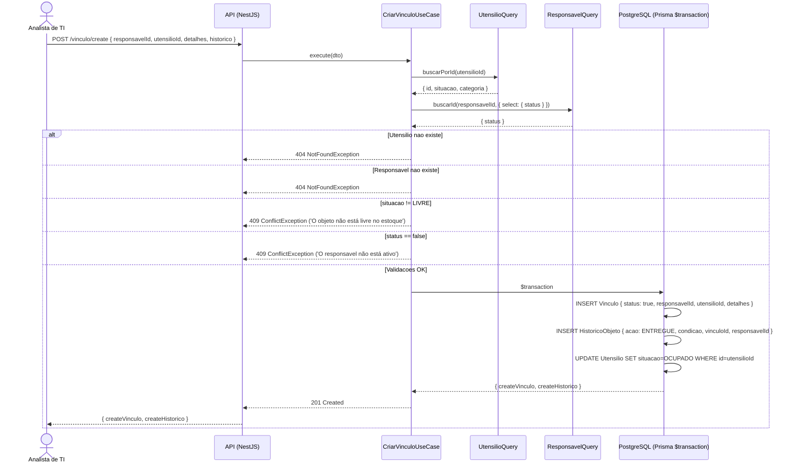
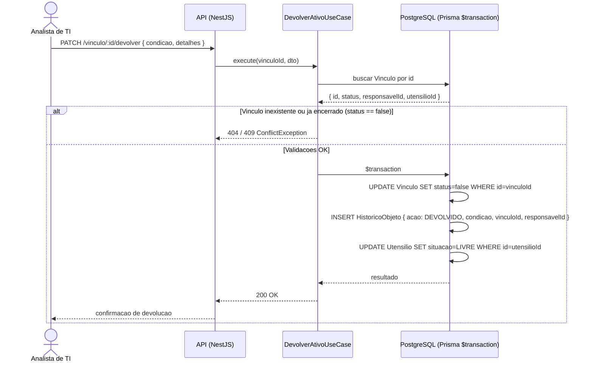
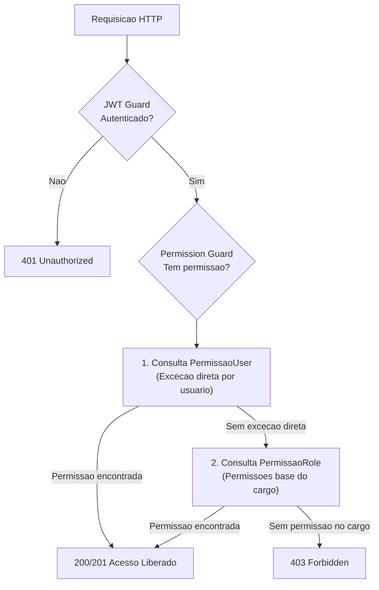
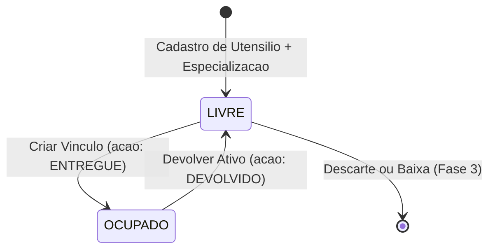
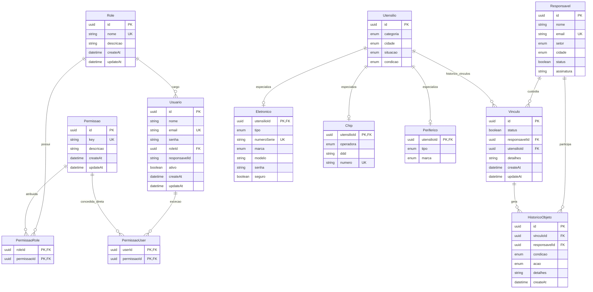

# PRD — Product Requirements Document
## Katrix Estoque · Sistema de Gestão de Ativos de TI

> **Versão:** 2.0.0  
> **Data:** 2026-08-26  
> **Status:** Em desenvolvimento (Fase 1 / Schema TPT & RBAC Híbrido Validado)  
> **Autor:** Equipe de Produto & Engenharia  

---

## Sumário

1. [Declaração do Problema](#1-declaração-do-problema)
2. [Objetivos e KPIs](#2-objetivos-e-kpis)
3. [Escopo e Fases](#3-escopo-e-fases)
4. [Personas](#4-personas)
5. [Épicos e Funcionalidades](#5-épicos-e-funcionalidades)
6. [Fluxos de Negócio](#6-fluxos-de-negócio)
7. [Modelo de Dados](#7-modelo-de-dados)
8. [Segurança e Controle de Acesso](#8-segurança-e-controle-de-acesso)
9. [Stack Tecnológica](#9-stack-tecnológica)
10. [Log de Decisões de Design (ADRs)](#10-log-de-decisões-de-design-adrs)
11. [Restrições e Requisitos Não Funcionais](#11-restrições-e-requisitos-não-funcionais)
12. [Glossário](#12-glossário)

---

## 1. Declaração do Problema

### 1.1 Contexto

O setor de TI gerencia um parque tecnológico distribuído em múltiplas cidades (Fortaleza, Juazeiro, Joinville, João Pessoa) abrangendo notebooks, celulares, tablets, chips de operadoras e periféricos (mouse, teclado, carregador, etc.). O controle manual e descentralizado gera riscos de perda de ativos, falta de histórico confiável e insegurança operacional.

### 1.2 Dores Identificadas

| # | Dor | Impacto |
|---|-----|---------|
| D-01 | **Ausência de rastreabilidade** — não é possível saber quem está com qual equipamento | Perda de ativos, sem accountability |
| D-02 | **Sem histórico de movimentações** — não há registro de quando, para quem e em que estado um ativo foi entregue ou devolvido | Impossibilidade de auditorias internas |
| D-03 | **Ciclo de vida desconhecido** — a condição atual dos ativos (Novo, Semi-Novo, Usado) não é registrada | Decisões de compra/descarte sem dados |
| D-04 | **Inventário inconsistente** — ativos "livres" podem estar com alguém sem registro | Duplicidade de entrega do mesmo ativo |
| D-05 | **Gestão multi-cidade sem visão centralizada** — cada localidade opera de forma isolada | Falta de visão gerencial consolidada |
| D-06 | **Sem controle de acesso granular** — ausência de modelo híbrido de papéis e exceções | Risco de integridade dos dados |

### 1.3 Hipótese de Solução

Um sistema web interno (**Katrix Estoque**) com arquitetura limpa, CQRS, modelo de herança Table-per-Type (TPT com `Utensilio`), motor de vínculos atômico (ACID) e controle de acesso RBAC Híbrido com suporte nativo a `PermissaoRole` e `PermissaoUser`.

---

## 2. Objetivos e KPIs

### 2.1 Objetivos de Negócio

| OBJ | Descrição | Prazo |
|-----|-----------|-------|
| OBJ-01 | Eliminar a perda de ativos por falta de rastreio | Fase 1 |
| OBJ-02 | Ter 100% dos ativos de TI cadastrados no sistema centralizado | Fase 1 |
| OBJ-03 | Viabilizar auditoria completa do ciclo de vida de qualquer ativo | Fase 1 |
| OBJ-04 | Reduzir o tempo de busca por um ativo de horas para segundos | Fase 1 |
| OBJ-05 | Oferecer visão gerencial por cidade, setor e categoria | Fase 2 |

### 2.2 KPIs Mensuráveis

| KPI | Meta | Como Medir |
|-----|------|------------|
| **Cobertura de inventário** | 100% dos ativos cadastrados | Total de `Utensilio` no sistema vs. inventário físico |
| **Rastreabilidade de entrega** | 0 entregas sem vínculo registrado | Itens com `situacao = OCUPADO` sem registro ativo em `Vinculo` |
| **Integridade do histórico** | 0 registros de HistoricoObjeto alterados | Auditoria de registros imutáveis (sem `updateAt`) |
| **Tempo médio de consulta** | < 200ms para listagens paginadas | Latência de resposta da API via `BaseQuery` |
| **Atividade por responsável** | Relatório disponível em < 5 cliques | Fluxo de navegação no front-end (Fase 2) |

---

## 3. Escopo e Fases

### 3.1 Fase 1 — MVP (Em Andamento)

**Objetivo:** Colocar em produção interna o core do sistema com arquitetura desacoplada TPT e motor de vínculos seguro.

**Incluso:**
- [x] Infraestrutura (NestJS + PostgreSQL 15 via Docker + Prisma ORM)
- [x] Modelo de dados TPT (`Utensilio`, `Eletronico`, `Chip`, `Periferico`)
- [x] Modelo RBAC Híbrido no banco (`Role`, `Permissao`, `PermissaoRole`, `PermissaoUser`, `Usuario`)
- [x] Módulo `Responsavel` — CRUD completo (criar, listar paginado, buscar por e-mail, atualizar, soft-delete)
- [x] Módulo `Eletronico` — Cadastro e listagem paginada
- [x] Módulo `Vinculo` — Criação atômica de vínculo com validações e gravação em `HistoricoObjeto`
- [ ] Atualização dos Use Cases e Repositories para gravar `Utensilio` e associar `Vinculo.utensilioId`
- [ ] Módulo `Chip` — Cadastro, listagem e vinculação
- [ ] Módulo `Periferico` — Cadastro, listagem e vinculação
- [ ] Ação de **devolução** de ativo (encerramento de vínculo + `HistoricoObjeto` com ação `DEVOLVIDO`)
- [ ] Módulo de Autenticação JWT e Guards de Permissão RBAC Híbrido

**Excluído da Fase 1:**
- Dashboard analítico avançado
- Relatórios exportáveis em PDF/XLSX
- Assinatura digital com biometria ou certificado ICP-Brasil

---

## 4. Personas

### Persona 1 — Analista de TI (Operacional)
- **Papel:** Operador de campo responsável pelo recebimento, cadastro de hardware e entrega/devolução de equipamentos.
- **Necessidade:** Agilidade operacional com feedback imediato e validações que impeçam erro humano.

### Persona 2 — Gestor de TI (Gerencial)
- **Papel:** Coordenador de infraestrutura e patrimônio.
- **Necessidade:** Visibilidade instantânea de estoque livre/ocupado por filial e linha do tempo de histórico auditável.

### Persona 3 — Responsável pelo Ativo (Passivo)
- **Papel:** Colaborador da empresa que recebe o equipamento para trabalho.
- **Necessidade:** Clareza sobre os itens sob sua custódia e comprovante formal de entrega/devolução.

### Persona 4 — Administrador do Sistema
- **Papel:** Responsável pela segurança e governança de acessos.
- **Necessidade:** Gerenciamento de operadores, atribuição de cargos e concessão de exceções pontuais via `PermissaoUser`.

---

## 5. Épicos e Funcionalidades

### Épico 1 — Gestão de Responsáveis
- **F-01:** Criar responsável (nome, e-mail único, setor, cidade, status). `POST /responsavel/create`
- **F-02:** Listar responsáveis com paginação (`BaseQuery`). `GET /responsavel/listar`
- **F-03:** Consultar responsável por e-mail. `GET /responsavel/:email`
- **F-04:** Atualizar responsável com validação de colisão de e-mail. `PATCH /responsavel/:id`
- **F-05:** Desativação lógica de responsável (`status = false`). `DELETE /responsavel/:id`
- **F-06:** Bloqueio de vínculo para responsável inativo.

### Épico 2 — Gestão de Itens e Eletrônicos (Padrão TPT)
- **F-07:** Cadastrar eletrônico (cria registro em `Utensilio` com `categoria = ELETRONICO` e extensão em `Eletronico`). `POST /eletronico/create`
- **F-08:** Listar eletrônicos com paginação e dados de vínculo. `GET /eletronico/listar`
- **F-09:** Consultar eletrônico por ID. `GET /eletronico/:id`
- **F-10:** Atualizar dados do eletrônico. `PATCH /eletronico/:id`
- **F-11:** Registro de seguro e número de série único global.

### Épico 3 — Gestão de Chips Telefônicos
- **F-12:** Cadastrar chip (cria `Utensilio` com `categoria = CHIP` e extensão em `Chip`). `POST /chip/create`
- **F-13:** Listar chips com paginação. `GET /chip/listar`
- **F-14:** Vincular chip via motor de vínculos unificado (`utensilioId`).

### Épico 4 — Gestão de Periféricos
- **F-15:** Cadastrar periférico (cria `Utensilio` com `categoria = PERIFERICO` e extensão em `Periferico`). `POST /periferico/create`
- **F-16:** Listar periféricos paginados. `GET /periferico/listar`
- **F-17:** Vincular periférico via motor de vínculos unificado (`utensilioId`).

### Épico 5 — Motor de Vínculos e Histórico Imutável
- **F-18:** Criar vínculo atômico associando `responsavelId` e `utensilioId` em `$transaction`. `POST /vinculo/create`
- **F-19:** Validações de pré-condição (`Utensilio.situacao == LIVRE`, `Responsavel.status == true`).
- **F-20:** Gravação automática e imutável em `HistoricoObjeto` (`acao = ENTREGUE`).
- **F-21:** Atualização atômica de `Utensilio.situacao = OCUPADO`.
- **F-22:** Registrar devolução atômica (`Vinculo.status = false`, `HistoricoObjeto` `DEVOLVIDO`, `Utensilio.situacao = LIVRE`). `PATCH /vinculo/:id/devolver`
- **F-23:** Consultar linha do tempo de histórico por item ou por colaborador.

### Épico 6 — Autenticação, Usuários e RBAC Híbrido
- **F-24:** Cadastro de usuário operador com hash Bcrypt e `ativo = true`.
- **F-25:** Login via credenciais emitindo JWT assinado. `POST /auth/login`
- **F-26:** Guard global de autenticação JWT (`JwtAuthGuard`).
- **F-27:** Guard de autorização RBAC Híbrido (`PermissionGuard`) com checagem: `PermissaoUser` > `PermissaoRole`.
- **F-28:** Concessão e revogação de exceção direta a usuário (`PermissaoUser`).
- **F-29:** Gestão de Roles e Permissões padrão (`PermissaoRole`).
---

## 6. Fluxos de Negócio

### 6.1 Fluxo de Vinculação de Ativo (Entrega com Motor TPT)



---

### 6.2 Fluxo de Devolução de Ativo



---

### 6.3 Fluxo de Controle de Acesso (RBAC Híbrido com PermissaoUser)



---

### 6.4 Ciclo de Vida do Ativo



---

## 7. Modelo de Dados

### 7.1 Diagrama Entidade-Relacionamento



### 7.2 Enumerações do Sistema

| Enum | Valores | Descrição |
|------|---------|-----------|
| `CategoriaDispositivo` | ELETRONICO, CHIP, PERIFERICO | Classificador da entidade base Utensilio |
| `Aparelhos` | NOTEBOOK, CELULAR, TABLET | Tipos de hardware eletrônico |
| `Perifericos` | MOUSE, TECLADO, MOUSE_PAD, CARREGADOR, SUPORTE | Tipos de acessórios |
| `Operadoras` | CLARO, TIM, VIVO | Operadoras de telefonia |
| `Marcas` | LENOVO, SAMSUNG, XIAOMI, MOTOROLA, GENERICO, OUTRA | Fabricantes |
| `Condicao` | NOVO, SEMI_NOVO, USADO | Estado físico do item |
| `Status` | LIVRE, OCUPADO | Disponibilidade do item |
| `Acao` | ENTREGUE, DEVOLVIDO | Ações registradas no histórico |
| `Setores` | COMERCIAL, BACKOFFICE, ADMINISTRATIVO, RELACIONAMENTO, TI | Departamentos corporativos |
| `Cidades` | FORTALEZA, JUAZEIRO, JOINVILLE, JOAO_PESSOA | Polos geográficos |

---

## 8. Segurança e Controle de Acesso

### 8.1 Modelo RBAC Híbrido

O sistema implementa o modelo **RBAC Híbrido** com suporte completo em banco de dados:
```
PermissaoUser (exceção direta do usuário) > PermissaoRole (permissões base do cargo)
```

- **`PermissaoRole`:** Concede conjuntos de permissões em lote através do cargo atribuído ao usuário (`Usuario.roleId`).
- **`PermissaoUser`:** Permite atribuir exceções pontuais a um operador específico sem necessidade de elevar seu cargo ou criar papéis artificiais.

---

## 9. Stack Tecnológica

| Camada | Tecnologia | Detalhes |
|---|---|---|
| Back-End | NestJS v11 + TypeScript strict | Clean Architecture + CQRS |
| ORM | Prisma ORM v7.8 | Engine nativa PostgreSQL |
| Banco de Dados | PostgreSQL 15 | Container Docker oficial (`postgres:15`, porta 5431:5432) |
| Front-End | Nuxt.js 3 + Vue 3 | SSR/SPA reativo em TypeScript |
| Autenticação | Passport JWT + Bcrypt | Tokens assinados com expiração estrita |

---

## 10. Log de Decisões de Design (ADRs)

### ADR-01 — Clean Architecture + CQRS no Back-End
- **Decisão:** Separação entre Controllers, Use Cases, Query Repositories (`BaseQuery<T>`) e Command Repositories.

### ADR-02 — RBAC Híbrido com Tabelas Associativas Dedicadas
- **Decisão:** Criação das entidades `PermissaoRole` e `PermissaoUser` no PostgreSQL com políticas `onDelete: Restrict`.

### ADR-03 — Transação ACID para o Ciclo de Vínculo
- **Decisão:** Toda entrega ou devolução executa em bloco `prisma.$transaction()`, atualizando `Vinculo`, `HistoricoObjeto` e `Utensilio.situacao`.

### ADR-04 — HistoricoObjeto como Ledger Imutável
- **Decisão:** Apenas `createAt DateTime @default(now())` sem `@updatedAt`, garantindo append-only.

### ADR-05 — PostgreSQL via Docker com Volume Persistente
- **Decisão:** Container com volume nomeado `postgres_data` e `restart: always`.

### ADR-06 — BaseQuery como Repositório Genérico Paginado
- **Decisão:** Reutilização de rotinas de paginação e metadados padronizados.

### ADR-07 — Herança Table-per-Type (TPT) com a Entidade Base Utensilio
- **Decisão:** Introdução da entidade base `Utensilio` para centralizar atributos operacionais de ciclo de vida (`situacao`, `cidade`, `condicao`, `categoria`), com extensões 1:1 especializadas (`Eletronico`, `Chip`, `Periferico`).
- **Motivação:** Eliminação de redundâncias, simplificação radical do motor de vínculos (`Vinculo.utensilioId`) e desacoplamento para adição de novas categorias patrimoniais.

---

## 11. Restrições e Requisitos Não Funcionais

- **Persistência:** Tolerância zero à perda de dados; volume Docker durável.
- **Atomicidade:** Transações ACID em todas as mutações de inventário.
- **Segurança:** RBAC Híbrido, Bcrypt salt >= 10, JWT com expiração máxima de 60 min.
- **Performance:** Latência p95 < 200ms em listagens paginadas.

---

## 12. Glossário

| Termo | Definição |
|---|---|
| **Utensilio** | Entidade base patrimonial que concentra atributos de ciclo de vida (status, condição, cidade e categoria). |
| **Eletronico / Chip / Periferico** | Especializações físicas 1:1 de `Utensilio` contendo atributos técnicos específicos de hardware. |
| **Vinculo** | Contrato relacional que associa um `Utensilio` a um `Responsavel`. |
| **HistoricoObjeto** | Ledger imutável de eventos de entrega e devolução. |
| **PermissaoUser** | Tabela associativa para concessão de permissões exclusivas diretas ao operador. |
